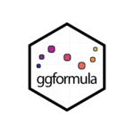

<!-- README.md is generated from README.Rmd. Please edit that file -->

```{r, setup, include = FALSE}
knitr::opts_chunk$set(
  collapse = TRUE,
  comment = "#>",
#  fig.path = "README-",
  fig.width = 7, 
  fig.height = 3
)
library(ggformula)
```

# ggformula 


[](https://cran.r-project.org/package=ggformula)

## ggplot2 via formulas and pipes

`ggformula` introduces a family of graphics functions, `gf_point()`,
`gf_density()`, and so on, bringing the formula interface to `ggplot()`. This
captures and extends the excellent simplicity of the `lattice`-graphics' formula
interface, while providing the intuitive "add this component" capabilities of
`ggplot2` using `maggrittr` pipes.

## Installation

You can install from CRAN with

```{r, eval = FALSE}
install.packages("ggformula")
```

or from github with:

```{r gh-installation, eval = FALSE}
# install.packages("devtools")
devtools::install_github("ProjectMOSAIC/ggformula")
```

## Using ggformula

The following example illustrates a typical plot constructed with ggformula.

```{r example}
library(ggformula)
gf_jitter(Sepal.Length ~ Sepal.Width, data = iris, color = ~ Species,
          width = 0.05, height = 0.05, alpha = 0.6) %>%
  gf_density2d(alpha = 0.3) %>%
  gf_labs(title = "A famous data set",
          caption = "Data available in datasets package",
          ylab = "sepal length",
          xlab = "sepal width"
  ) %>%
  gf_theme(theme_bw()) %>%
  gf_theme(text = element_text(colour = "navy", face = "italic"))
```

### Tutorials

Interactive tutorials demonstrating the package functionality can be run with

```r
learnr::run_tutorial("introduction", package = "ggformula")
learnr::run_tutorial("refining", package = "ggformula")
```

### Package Vignette

The package vignette is available at [https://cran.r-project.org/package=ggformula/vignettes/ggformula.html](https://cran.r-project.org/package=ggformula/vignettes/ggformula.html).